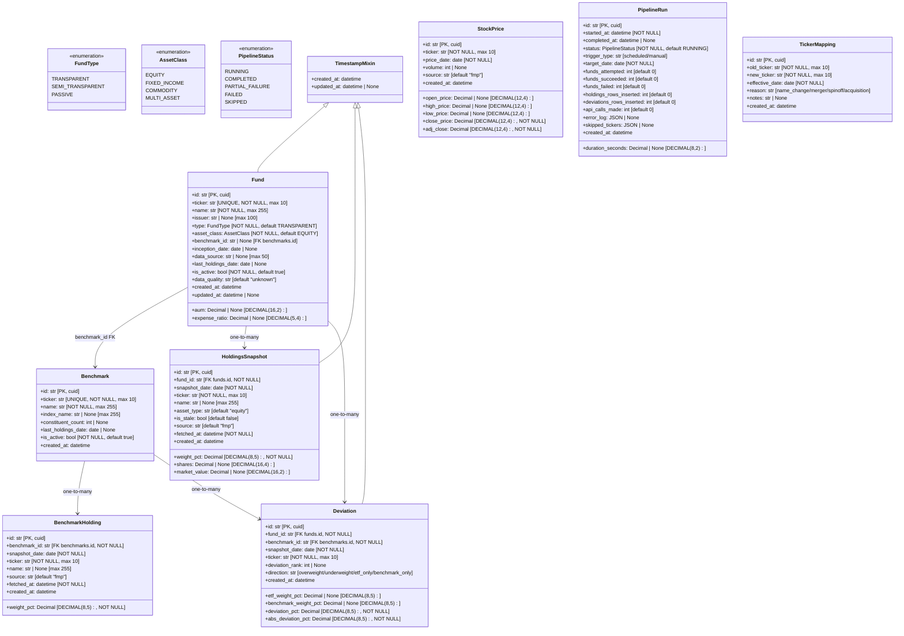
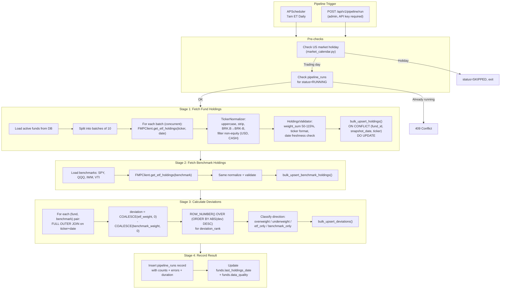
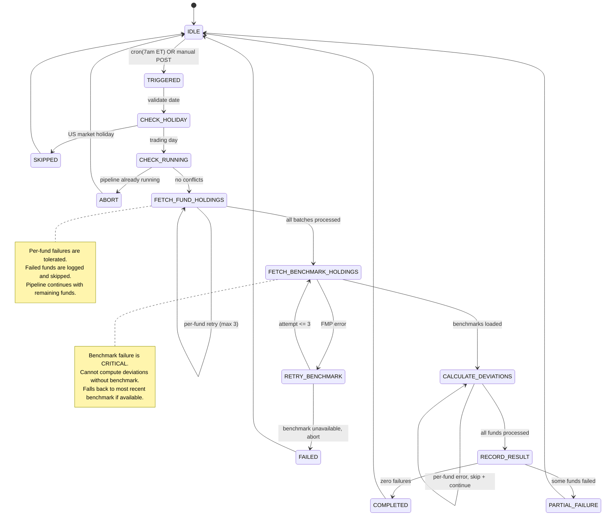
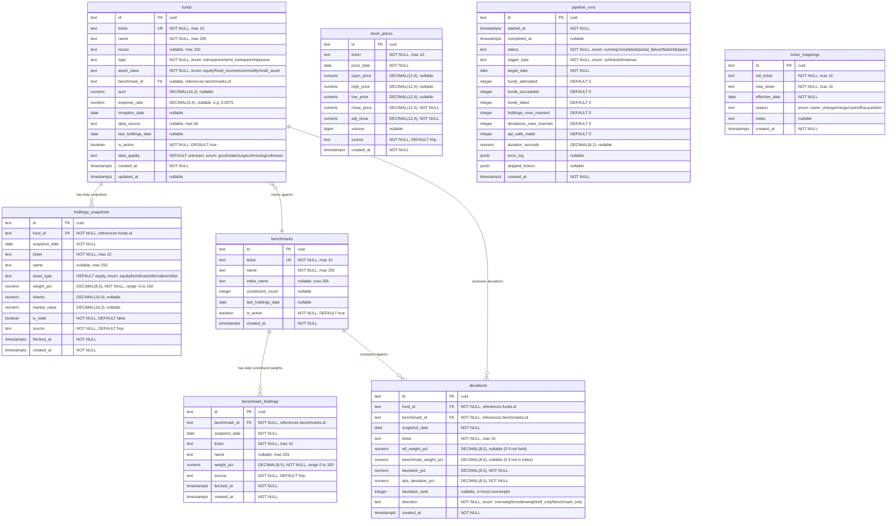

# Architecture Spec — Active Alpha

> Auto-generated by `/plan`. Living document — validated on every `/build` and `/improve`.
> Last updated: 2026-03-28
> Last validated: 2026-03-28

---

## 1. File & folder structure

```
projects/active-alpha/
├── BRIEF.md
├── CLAUDE.md
├── .env.example
├── .gitignore
├── docker-compose.yml                   # backend + postgres + redis
├── docs/
│   ├── ARCHITECTURE.md                  # This file
│   ├── DECISIONS.md                     # Think Tank debate log
│   └── TASKS.md                         # Ordered implementation plan
├── backend/
│   ├── app/
│   │   ├── __init__.py
│   │   ├── main.py                      # FastAPI app factory, lifespan, router registration
│   │   ├── config.py                    # pydantic-settings: DB, Redis, FMP, scheduler config
│   │   ├── database.py                  # Async engine + session factory + raw connection
│   │   ├── dependencies.py              # Depends: get_db, get_fmp_client, require_api_key
│   │   │
│   │   ├── models/
│   │   │   ├── __init__.py              # Re-exports all models for Alembic
│   │   │   ├── base.py                  # DeclarativeBase, UUID mixin, timestamp mixin
│   │   │   ├── fund.py                  # Fund model + FundType/AssetClass enums
│   │   │   ├── benchmark.py             # Benchmark model
│   │   │   ├── holdings_snapshot.py     # HoldingsSnapshot model
│   │   │   ├── benchmark_holding.py     # BenchmarkHolding model
│   │   │   ├── deviation.py             # Deviation model
│   │   │   ├── stock_price.py           # StockPrice model
│   │   │   ├── pipeline_run.py          # PipelineRun model
│   │   │   └── ticker_mapping.py        # TickerMapping model
│   │   │
│   │   ├── schemas/
│   │   │   ├── __init__.py
│   │   │   ├── common.py               # PaginatedResponse, ErrorResponse, CursorPagination
│   │   │   ├── fund.py                  # FundResponse, FundListResponse, FundDetailResponse
│   │   │   ├── holdings.py              # HoldingRecord, HoldingsSnapshotResponse
│   │   │   ├── deviation.py             # DeviationRecord, DeviationResponse, TopDeviationAcrossFunds
│   │   │   ├── benchmark.py             # BenchmarkResponse, BenchmarkListResponse
│   │   │   └── pipeline.py              # PipelineRunResponse, PipelineHealth, PipelineTriggerRequest
│   │   │
│   │   ├── routers/
│   │   │   ├── __init__.py
│   │   │   ├── funds.py                 # /api/v1/funds — list with filters, detail with top deviations
│   │   │   ├── holdings.py              # /api/v1/funds/{ticker}/holdings — by fund+date
│   │   │   ├── deviations.py            # /api/v1/funds/{ticker}/deviations — by fund, top movers, stock lookup
│   │   │   ├── benchmarks.py            # /api/v1/benchmarks — list, holdings
│   │   │   ├── pipeline.py              # /api/v1/pipeline — trigger (admin), status, history
│   │   │   ├── stocks.py               # /api/v1/stocks/{ticker}/holders — cross-fund analysis
│   │   │   └── health.py               # /health, /ready — no prefix
│   │   │
│   │   ├── services/
│   │   │   ├── __init__.py
│   │   │   ├── fund_service.py          # Fund CRUD, universe sync
│   │   │   ├── holdings_service.py      # Fetch + normalize + validate + store holdings
│   │   │   ├── benchmark_service.py     # Fetch + store benchmark holdings
│   │   │   ├── deviation_service.py     # Calculate deviations via SQL, rank, store
│   │   │   ├── price_service.py         # Fetch + store stock prices (Phase 2 prep)
│   │   │   └── pipeline_orchestrator.py # Daily pipeline: coordinates all services, error recovery
│   │   │
│   │   ├── clients/
│   │   │   ├── __init__.py
│   │   │   └── fmp_client.py            # FMP API wrapper: rate limiting, retry, response parsing
│   │   │
│   │   ├── scheduler/
│   │   │   ├── __init__.py
│   │   │   └── jobs.py                  # APScheduler job definitions, 7am ET cron trigger
│   │   │
│   │   └── utils/
│   │       ├── __init__.py
│   │       ├── ticker_normalizer.py     # Normalize ticker formats, filter non-equity
│   │       ├── bulk_ops.py              # Batch upsert helpers using raw SQL ON CONFLICT
│   │       ├── market_calendar.py       # US market holiday detection
│   │       └── validation.py            # Holdings data quality validation
│   │
│   ├── alembic/
│   │   ├── env.py                       # Sync engine for migrations
│   │   └── versions/
│   │       └── 001_initial_schema.py
│   ├── alembic.ini
│   │
│   ├── tests/
│   │   ├── __init__.py
│   │   ├── conftest.py                  # Fixtures: async db session, FMP mock, test data
│   │   ├── test_fmp_client.py           # Rate limits, retries, parsing, error handling
│   │   ├── test_ticker_normalizer.py    # Normalization edge cases
│   │   ├── test_deviation_service.py    # Deviation calc correctness, edge cases
│   │   ├── test_holdings_service.py     # Normalization, validation, weight checks
│   │   ├── test_pipeline_orchestrator.py # Flow, partial failure, retry logic
│   │   ├── test_bulk_ops.py             # Upsert correctness, conflict resolution
│   │   ├── test_validation.py           # Data quality validation rules
│   │   └── test_routers/
│   │       ├── __init__.py
│   │       ├── test_funds.py
│   │       ├── test_holdings.py
│   │       ├── test_deviations.py
│   │       └── test_health.py
│   │
│   ├── scripts/
│   │   ├── seed_funds.py                # Seed fund universe (50+ tickers + benchmarks)
│   │   └── backfill.py                  # Backfill historical holdings/deviations
│   │
│   ├── Dockerfile
│   ├── requirements.txt
│   ├── requirements-dev.txt
│   └── pyproject.toml
│
└── scripts/
    └── seed.py                          # Convenience wrapper for seed_funds.py
```

**Conventions:**

- Snake_case for Python files, PascalCase for classes
- Pydantic schemas are separate from SQLAlchemy models — schemas in `schemas/`, models in `models/`
- Routers are thin — delegate to services, no business logic
- Services contain business logic, no HTTP concerns
- `clients/` is separate from `services/` — FMP client is a pure HTTP adapter
- `utils/bulk_ops.py` uses raw SQL for pipeline writes (10-50x faster than ORM for bulk)
- All API routes under `/api/v1/` prefix

---

## 2. Class & interface definitions

### 2.1 Core domain models (SQLAlchemy)



### 2.2 Key interfaces (Python protocols)

```python
# app/services/protocols.py

@runtime_checkable
class FMPClientProtocol(Protocol):
    async def get_etf_holdings(self, ticker: str, date: date | None = None) -> list[dict]: ...
    async def get_etf_list(self) -> list[dict]: ...
    async def get_stock_price_history(self, ticker: str, from_date: date, to_date: date) -> list[dict]: ...
    async def get_etf_info(self, ticker: str) -> dict | None: ...
    async def close(self) -> None: ...

@runtime_checkable
class HoldingsServiceProtocol(Protocol):
    async def fetch_and_store_holdings(self, fund_id: str, fund_ticker: str, target_date: date) -> int: ...
    async def fetch_and_store_batch(self, funds: list[tuple[str, str]], target_date: date, batch_size: int = 10) -> BatchResult: ...

@runtime_checkable
class BenchmarkServiceProtocol(Protocol):
    async def fetch_and_store_benchmark_holdings(self, benchmark_id: str, benchmark_ticker: str, target_date: date) -> int: ...
    async def fetch_all_benchmarks(self, target_date: date) -> dict[str, int]: ...

@runtime_checkable
class DeviationServiceProtocol(Protocol):
    async def calculate_deviations(self, fund_id: str, benchmark_id: str, target_date: date) -> int: ...
    async def calculate_all_deviations(self, target_date: date) -> int: ...

@runtime_checkable
class PipelineOrchestratorProtocol(Protocol):
    async def run_daily_pipeline(self, target_date: date | None = None) -> PipelineRunResult: ...
    async def run_partial_pipeline(self, fund_tickers: list[str], target_date: date) -> PipelineRunResult: ...
    async def get_status(self) -> PipelineHealth: ...
```

### 2.3 Service classes

```python
# app/clients/fmp_client.py
class FMPClient:
    BASE_URL = "https://financialmodelingprep.com/api/v3"
    def __init__(self, api_key: str, max_concurrent: int = 5, requests_per_minute: int = 250, timeout: float = 30.0): ...
    async def get_etf_holdings(self, ticker: str, target_date: date | None = None) -> list[dict]: ...
    async def get_etf_list(self) -> list[dict]: ...
    async def get_stock_price_history(self, ticker: str, from_date: date, to_date: date) -> list[dict]: ...
    async def get_etf_info(self, ticker: str) -> dict | None: ...
    async def close(self) -> None: ...
    # Internal: _request(endpoint, params), _retry_with_backoff(url, params)

class RateLimiter:
    def __init__(self, max_requests: int, window_seconds: float = 60.0): ...
    async def acquire(self) -> None: ...
    def remaining(self) -> int: ...

# app/services/holdings_service.py
class HoldingsService:
    def __init__(self, db: AsyncSession, fmp: FMPClient, normalizer: TickerNormalizer): ...
    async def fetch_and_store_holdings(self, fund_id: str, fund_ticker: str, target_date: date) -> int: ...
    async def fetch_and_store_batch(self, funds: list[tuple[str, str]], target_date: date, batch_size: int = 10) -> BatchResult: ...
    async def get_holdings(self, fund_ticker: str, target_date: date) -> list[HoldingsSnapshot]: ...
    # Internal: _normalize_fmp_holdings(raw), _validate_holdings(fund_ticker, date, rows), _bulk_upsert(fund_id, date, holdings)

# app/services/deviation_service.py
class DeviationService:
    def __init__(self, db: AsyncSession): ...
    async def calculate_deviations(self, fund_id: str, benchmark_id: str, target_date: date) -> int: ...
    async def calculate_all_deviations(self, target_date: date) -> int: ...
    async def get_fund_deviations(self, fund_ticker: str, target_date: date, limit: int = 100, cursor: str | None = None) -> DeviationResponse: ...
    async def get_top_deviations_across_funds(self, target_date: date, limit: int = 50) -> list[TopDeviationAcrossFunds]: ...
    async def get_stock_holders(self, stock_ticker: str, target_date: date, limit: int = 50) -> list[StockHolderRecord]: ...

# app/services/pipeline_orchestrator.py
class PipelineOrchestrator:
    def __init__(self, db_factory: async_sessionmaker, fmp: FMPClient): ...
    async def run_daily_pipeline(self, target_date: date | None = None) -> PipelineRunResult: ...
    async def run_partial_pipeline(self, fund_tickers: list[str], target_date: date) -> PipelineRunResult: ...
    async def get_status(self) -> PipelineHealth: ...
    async def get_run_history(self, limit: int = 20) -> list[PipelineRun]: ...
    # Internal: _stage_fetch_holdings(funds, date), _stage_fetch_benchmarks(date), _stage_calculate_deviations(date), _store_run_result(result)

# app/utils/ticker_normalizer.py
class TickerNormalizer:
    NON_EQUITY_TICKERS = {"USD", "CASH", "TBILL", "BILL"}
    def __init__(self, alias_map: dict[str, str] | None = None): ...
    def normalize(self, ticker: str) -> str | None: ...  # Returns None for non-equity
    def normalize_batch(self, tickers: list[str]) -> list[str]: ...
    def is_equity(self, ticker: str) -> bool: ...
    def resolve_alias(self, ticker: str) -> str: ...

# app/utils/validation.py
class HoldingsValidator:
    def validate_snapshot(self, fund_ticker: str, snapshot_date: date, rows: list[dict]) -> ValidationResult: ...
    def check_weight_sum(self, rows: list[dict]) -> tuple[float, list[str]]: ...
    def check_staleness(self, snapshot_date: date, expected_date: date) -> bool: ...
```

### 2.4 Pydantic schemas

```python
# app/schemas/common.py
class ErrorResponse(BaseModel):
    error: str
    code: str
    details: Any = None

class CursorPagination(BaseModel):
    next_cursor: str | None = None
    has_more: bool = False
    total_count: int

class PaginatedResponse(BaseModel, Generic[T]):
    data: list[T]
    pagination: CursorPagination

# app/schemas/fund.py
class FundResponse(BaseModel):
    model_config = ConfigDict(from_attributes=True)
    id: str
    ticker: str
    name: str
    issuer: str | None
    type: str
    asset_class: str
    benchmark: BenchmarkShort | None  # {ticker, name}
    aum: str | None  # Decimal as string
    expense_ratio: str | None
    last_holdings_date: date | None
    data_quality: str
    is_active: bool

class FundDetailResponse(FundResponse):
    inception_date: date | None
    holdings_count: int
    top_deviations: list[DeviationRecord]

# app/schemas/deviation.py
class DeviationRecord(BaseModel):
    ticker: str
    etf_weight_pct: str  # Decimal as string for precision
    benchmark_weight_pct: str
    deviation_pct: str
    abs_deviation_pct: str
    direction: str  # overweight, underweight, etf_only, benchmark_only

class DeviationResponse(BaseModel):
    fund_ticker: str
    benchmark_ticker: str
    snapshot_date: date
    data: list[DeviationRecord]
    pagination: CursorPagination

# app/schemas/pipeline.py
class PipelineHealth(BaseModel):
    last_run: PipelineRunResponse | None
    data_freshness: DataFreshness
    schedule: ScheduleInfo

class PipelineRunResponse(BaseModel):
    id: str
    started_at: datetime
    completed_at: datetime | None
    status: str
    trigger_type: str
    target_date: date
    funds_succeeded: int
    funds_failed: int
    holdings_rows_inserted: int
    deviations_rows_inserted: int
    duration_seconds: float | None
```

---

## 3. Data flow diagrams

### 3.1 Daily pipeline flow



### 3.2 Pipeline state machine



---

## 4. ER / data model diagrams



**Indexes:**

```sql
-- Composite unique constraints (idempotent upserts)
CREATE UNIQUE INDEX uq_holdings_fund_date_ticker ON holdings_snapshots(fund_id, snapshot_date, ticker);
CREATE UNIQUE INDEX uq_benchmark_bench_date_ticker ON benchmark_holdings(benchmark_id, snapshot_date, ticker);
CREATE UNIQUE INDEX uq_deviations_fund_bench_date_ticker ON deviations(fund_id, benchmark_id, snapshot_date, ticker);
CREATE UNIQUE INDEX uq_prices_ticker_date ON stock_prices(ticker, price_date);

-- Query performance
CREATE INDEX ix_holdings_fund_date ON holdings_snapshots(fund_id, snapshot_date DESC);
CREATE INDEX ix_holdings_date ON holdings_snapshots(snapshot_date DESC);
CREATE INDEX ix_benchmark_bench_date ON benchmark_holdings(benchmark_id, snapshot_date DESC);
CREATE INDEX ix_deviations_fund_date ON deviations(fund_id, snapshot_date DESC);
CREATE INDEX ix_deviations_ticker_date ON deviations(ticker, snapshot_date DESC);
CREATE INDEX ix_deviations_abs ON deviations(fund_id, snapshot_date, abs_deviation_pct DESC);
CREATE INDEX ix_pipeline_runs_status ON pipeline_runs(status, started_at DESC);
```

---

## 5. API endpoints (Phase 1)

### Funds

| Method | Path                     | Auth   | Description                             |
| ------ | ------------------------ | ------ | --------------------------------------- |
| GET    | `/api/v1/funds`          | Public | List all tracked ETFs with filters      |
| GET    | `/api/v1/funds/{ticker}` | Public | Fund detail with top deviations summary |

### Holdings

| Method | Path                              | Auth   | Description                            |
| ------ | --------------------------------- | ------ | -------------------------------------- |
| GET    | `/api/v1/funds/{ticker}/holdings` | Public | Holdings snapshot for a fund on a date |

### Deviations

| Method | Path                                        | Auth   | Description                                      |
| ------ | ------------------------------------------- | ------ | ------------------------------------------------ |
| GET    | `/api/v1/funds/{ticker}/deviations`         | Public | Deviations for a fund vs benchmark               |
| GET    | `/api/v1/funds/{ticker}/deviations/history` | Public | Deviation history for a specific stock in a fund |

### Cross-fund analysis

| Method | Path                              | Auth   | Description                                 |
| ------ | --------------------------------- | ------ | ------------------------------------------- |
| GET    | `/api/v1/stocks/{ticker}/holders` | Public | Which ETFs hold this stock + deviation data |

### Benchmarks

| Method | Path                                   | Auth   | Description                   |
| ------ | -------------------------------------- | ------ | ----------------------------- |
| GET    | `/api/v1/benchmarks`                   | Public | List available benchmarks     |
| GET    | `/api/v1/benchmarks/{ticker}/holdings` | Public | Benchmark constituent weights |

### Pipeline

| Method | Path                      | Auth            | Description                              |
| ------ | ------------------------- | --------------- | ---------------------------------------- |
| GET    | `/api/v1/pipeline/status` | Public          | Pipeline health, last run info, next run |
| POST   | `/api/v1/pipeline/run`    | Admin (API key) | Manually trigger pipeline                |
| GET    | `/api/v1/pipeline/runs`   | Admin (API key) | Pipeline run history                     |

### Health

| Method | Path      | Auth   | Description                  |
| ------ | --------- | ------ | ---------------------------- |
| GET    | `/health` | Public | Basic health check           |
| GET    | `/ready`  | Public | Readiness check (DB + Redis) |

**Common query parameters:**

- `date` (YYYY-MM-DD): Target date, defaults to latest available
- `limit` (int): Page size, default 50, max 500
- `cursor` (string): Opaque cursor for pagination
- `sort` (string): Sort field
- `order` (asc/desc): Sort order

**Error response format:**

```json
{
  "error": "Fund with ticker XYZZ not found",
  "code": "FUND_NOT_FOUND",
  "details": null
}
```

---

## 6. Design decisions log

| #   | Decision                                                | Rationale                                                                             | Alternatives considered                                                       | Date       |
| --- | ------------------------------------------------------- | ------------------------------------------------------------------------------------- | ----------------------------------------------------------------------------- | ---------- |
| 1   | FastAPI + async SQLAlchemy                              | Best async Python web framework, Pydantic v2 built-in                                 | Django REST, Flask                                                            | 2026-03-28 |
| 2   | FMP API as primary data source                          | Best coverage/price ratio ($29/mo), 1000+ ETFs                                        | EODHD, Finnhub, SEC EDGAR, scraping                                           | 2026-03-28 |
| 3   | PostgreSQL for storage                                  | JSONB for flexible configs, proven at scale, excellent indexing                       | TimescaleDB, ClickHouse                                                       | 2026-03-28 |
| 4   | Alembic for migrations                                  | Standard SQLAlchemy migration tool, version-controlled                                | raw SQL, Django migrations                                                    | 2026-03-28 |
| 5   | Raw SQL upserts for pipeline writes                     | ORM is 10-50x slower for bulk writes (25k-100k rows/day)                              | ORM bulk_insert_mappings, COPY                                                | 2026-03-28 |
| 6   | Deviations computed via SQL FULL OUTER JOIN             | Single pass, no Python memory, ROW_NUMBER() for ranking inline                        | Load into pandas, compute in Python                                           | 2026-03-28 |
| 7   | APScheduler with misfire_grace_time                     | Handles missed runs if server was down, async-native                                  | Celery Beat (overkill), external cron (no misfire recovery)                   | 2026-03-28 |
| 8   | Pipeline runs stored in DB (not just Redis)             | Persistent run history essential for debugging; Redis caches current status for speed | Redis-only (ephemeral), in-memory (lost on restart)                           | 2026-03-28 |
| 9   | Fund-level failures tolerated, benchmark failures abort | 5/500 fund failures acceptable; missing benchmark makes all deviations wrong          | Abort on any failure (too strict), ignore benchmark failures (incorrect data) | 2026-03-28 |
| 10  | Cursor-based pagination on all list endpoints           | Correct for time-series data at scale; offset degrades with large datasets            | Offset pagination (simpler but O(N) skip cost)                                | 2026-03-28 |
| 11  | Admin API key for pipeline endpoints                    | Simple, sufficient for single-admin system; prevents unauthorized FMP API usage       | Auth.js (overkill), IP allowlist (fragile)                                    | 2026-03-28 |
| 12  | Sliding-window rate limiter for FMP                     | Respects per-minute limits, asyncio.Semaphore caps concurrency                        | Token bucket, fixed-window                                                    | 2026-03-28 |
| 13  | Benchmarks fetched as ETFs via FMP                      | SPY/QQQ/IWM/VTI are ETFs themselves; no separate index holdings API needed            | Scrape index providers (complex), separate index data source (expensive)      | 2026-03-28 |
| 14  | ticker_mappings table for corporate actions             | Handles symbol changes (FB→META), mergers; applied during normalization               | Ignore (data drift over time), manual fix (doesn't scale)                     | 2026-03-28 |
| 15  | Market holiday detection before pipeline run            | Avoids wasting FMP API calls and creating confusing empty/stale data                  | Always run and handle empty responses (wastes API calls)                      | 2026-03-28 |

---

## 7. Validation checklist

```
Last validation: 2026-03-28
Status: ✅ PASS (initial architecture spec)

Checks:
- [x] All classes/interfaces in spec defined
- [x] All fields have exact types and constraints
- [x] ER diagram matches class definitions
- [x] State machine covers all pipeline states including error recovery
- [x] Data flow diagram shows complete pipeline
- [x] All API endpoints defined with auth requirements
- [ ] All classes/interfaces in codebase exist in spec (not yet built)
- [ ] File structure matches spec (not yet built)
```

### Drift log

| Date       | Type    | Detail                                                | Action taken     |
| ---------- | ------- | ----------------------------------------------------- | ---------------- |
| 2026-03-28 | initial | Full architecture spec created from Think Tank review | Created by /plan |
